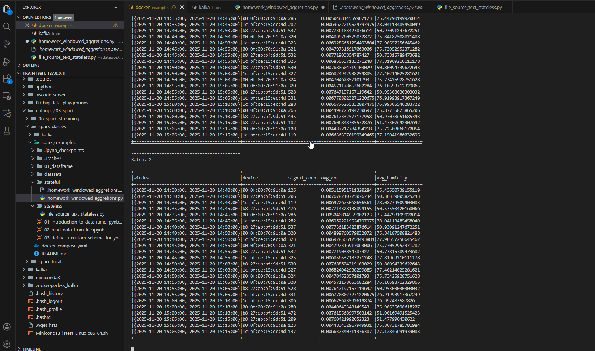

# IoT Streaming Window Aggregation - Spark Structured Streaming

Bu proje, IoT sensör verilerini gerçek zamanlı olarak işlemek, MinIO
üzerinden akan veriyi Spark Structured Streaming ile okuyup 10 dakikalık
window agregasyonları hesaplamak için hazırlanmıştır.

## 1. Ortam Kurulumu

Kafka container
Spark container
MinIO
Postgres
Zookeeper

Öncelikle verilen spark bileşenlerini içeren .yaml dosyası kullanılarak tüm bileşenler ayağa kaldırıldı:
``` bash
docker compose up -d
```

##  2. MinIO Giriş

MinIO UI: http://127.0.0.1:9001\
- Username: dataops\
- Password: Ankara06

IoT verilerini saklamak için bucket oluşturulur.
Bucket oluştur:

    datasets 

## 3. Kafka Container - Data Generator
İki farklı terminal açılır. Bu termillerin birinde Kafka diğerinde spark komutlarını kullanmak için.


``` bash
docker exec -it kafka bash
``` 
Data generator için gerekli python environment ve gerekli kütüphanelerin kurulumu yapılır.

``` 
python3 -m pip install pip --upgrade

cd /tmp/datagen/
python3 -m pip install virtualenv
python3 -m virtualenv .venv
source .venv/bin/activate

python3 -m pip install -r /data-generator/requirements.txt

```

Kafka container içerisinde ödev için kullanılacak olan iot_telemetry_data indirilir.

```
cd /tmp/datagen

wget https://github.com/erkansirin78/datasets/raw/master/iot_telemetry_data.csv.zip
unzip iot_telemetry_data.csv.zip
ls

```

Kafka ile S3 Minio'ya telemetry verileri data generator kullanarak yollanılır.

```
python dataframe_to_s3.py   -eu http://minio:9000   -buc datasets   -k /iot_stream_input/iot   -aki dataops   -sac Ankara06   -i /tmp/datagen/iot_telemetry_data.csv   -b 0.5   -z 10   -r 100   -oh False   -ofp False   -idx False
```

## 4. Spark Streaming - Window Aggregation

Window Aggregation için yazılan Python Spark container içinde spark-submit komutu ile çalıştırılır. Bu işlem sırasında Spark  Streaming, MinIO’daki iot_stream_input dizinine sürekli olarak yazılan CSV dosyalarını gerçek zamanlı olarak okur ve 10 dakikalık window agregasyonlarını konsola stream eder.

``` bash
docker exec -it spark bash
cd /opt/examples/stateful

spark-submit   --packages org.apache.hadoop:hadoop-aws:3.3.0   homework_windowed_aggregations.py
```

## Örnek Çıktı

    -------------------------------------------
    Batch: 5
    -------------------------------------------
    |window|device|signal_count|avg_co|avg_humidity|

##  Sonuç

-   Kafka → MinIO data stream
-   Spark → 10-minute sliding window aggregations
-   CO & Humidity ortalamaları hesaplandı
-   Tam gerçek zamanlı IoT pipeline başarıyla çalıştı

##  Streaming Output



