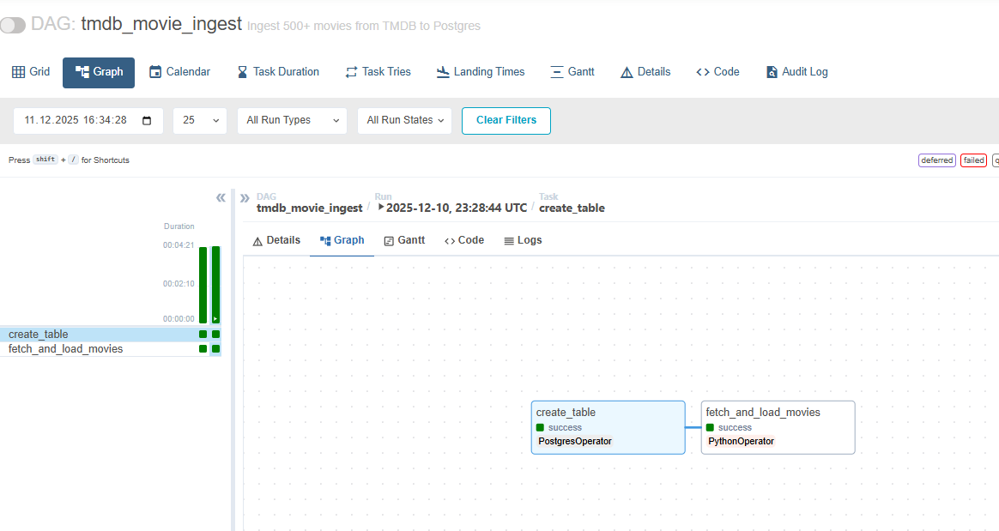
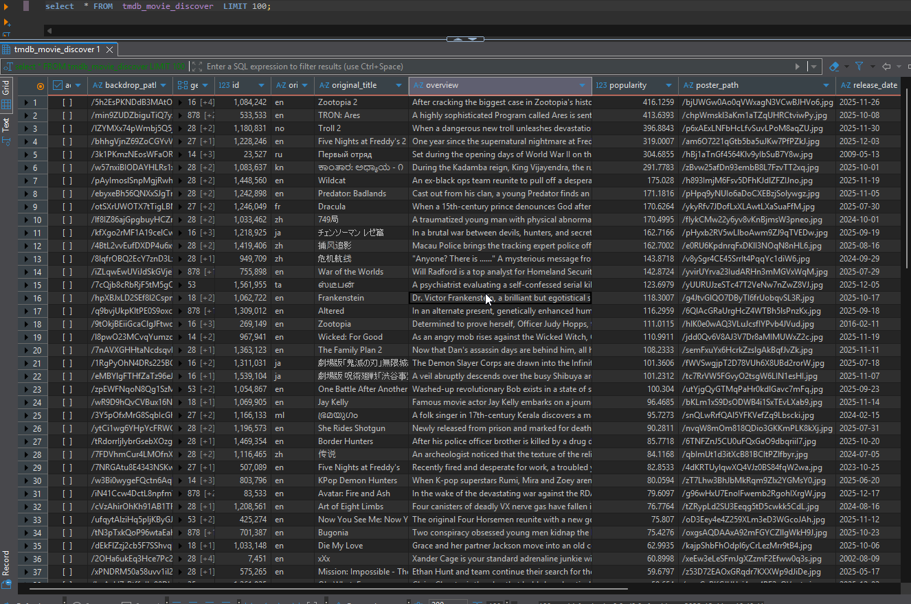

# TMDB Movie Discover Ingestion Pipeline  

Bu çalışma, TMDB Discover Movie API üzerinden en az **500 film** toplayarak PostgreSQL veri tabanındaki `tmdb_movie_discover` tablosuna yazan bir Airflow DAG'ının pipelineını kapsamaktadır. API erişimi için kullanılan token ve PostgreSQL bağlantı bilgileri Airflow içerisinde saklanmıştır.

## 1. Amaç

- TMDB Discover endpoint’inden popülerlik sırasına göre en az **500 film çekmek**  
- Filmleri PostgreSQL'deki `tmdb_movie_discover` tablosuna kaydetmek  
- Pipeline’ı Airflow üzerinde **@once** şeklinde zamanlamak  
- Airflow Variables ve Connections kullanarak **hassas bilgileri dışarı sızdırmamak**

## 2. PostgreSQL Tablo Şeması

```sql
CREATE TABLE IF NOT EXISTS tmdb_movie_discover (
    adult boolean,
    backdrop_path text,
    genre_ids integer[],
    id bigint,
    original_language text,
    original_title text,
    overview text,
    popularity double precision,
    poster_path text,
    release_date text,
    title text,
    video boolean,
    vote_average double precision,
    vote_count integer
);
```
## 3. Airflow Ekran Görüntüsü



## 4. Tablo Çıktısı




```
traindb=# \dt
               List of relations
 Schema |        Name         | Type  |  Owner  
--------+---------------------+-------+---------
 public | churn_modelling     | table | train
 public | customers_pandas    | table | train
 public | student             | table | train
 public | tmdb_movie_discover | table | airflow


       Column       |       Type       | Collation | Nullable | Default 
-------------------+------------------+-----------+----------+---------
 adult             | boolean          |           |          | 
 backdrop_path     | text             |           |          | 
 genre_ids         | integer[]        |           |          | 
 id                | bigint           |           |          | 
 original_language | text             |           |          | 
 original_title    | text             |           |          | 
 overview          | text             |           |          | 
 popularity        | double precision |           |          | 
 poster_path       | text             |           |          | 
 release_date      | text             |           |          | 
 title             | text             |           |          | 
 video             | boolean          |           |          | 
 vote_average      | double precision |           |          | 
 vote_count        | integer          |           |          | 
```

