# hdfs_commands_homework

cd komutu ile .yaml dosyasının bulunduğu klasöre giriyoruz. sonrasında .yaml dosyasında dataops klasörü user local olarak belirtildiği için hadoop clustera aktaracağımız dosyayı dataops klasörüne indirmemiz gerekiyor. 

```bash
cd 00_big_data_playgrounds/dataops

wget https://raw.githubusercontent.com/erkansirin78/datasets/master/Wine.csv
```

## Docker Login & Docker Pull
`.yaml` dosyası içerisinde bulunan imagelar **DockerHub** üzerinde bulunan repodan geldiği için önce login olmak gerekiyor. Sonrasında containerları ayağa kaldırmak için gereki imageları dockerhub üzerinde bulunan repodan çekmek gerekiyor.

```bash
docker login

docker pull veribilimiokulu/ubuntu_hadoop_hive_sqoop:3.0
```
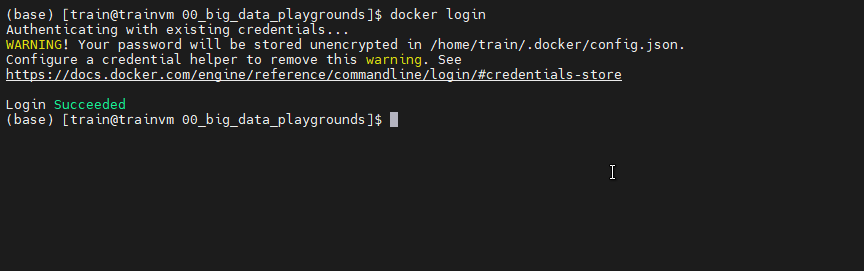

## Docker-Compose 

`.yaml` dosyasının olduğu klasöre cd ile girdikten sonra containerları ayağa kaldırmak için docker compose komutunu uyguluyoruz.

```bash
docker compose up -d

docker ps
```
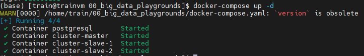

Docker ps ile 1 masternode 2 slave ve 1 postgresql containerlarını görebiliyoruz.

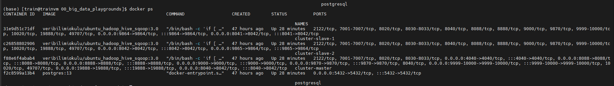

## Hadoop ortamına bağlanma

exec -it bash komutuyla cluster-muster master node a bağlanıp hadoop cli ye geçiş yapıyoruz. 

```bash
docker exec -it cluster-master bash

```

### İşlem yapacağımız klasörleri oluşturma

hadoop cliye geçiş yaptıktan sonra hdfs içerisinde odev klasörlerini oluşturmak için -mkdir komutunu kullanıyoruz.

```bash

hdfs dfs -mkdir -p /user/root/hdfs_odev
hdfs dfs -mkdir -p /tmp/hdfs_odev

```
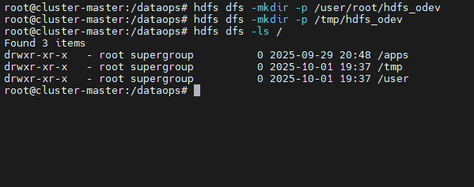

### Masternode ui üzerinde görüntüleme 

Masternode ui üzerinde oluşturduğumuz dosyaları görüntülemek için öncelikle vm üzerinde çalışan konteynırlara dışardan ulaşmak için port-forwarding yapmamız gerekiyor. VM kullandığımız için bu işlem gerekli

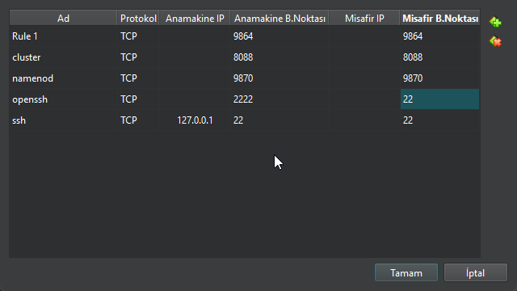

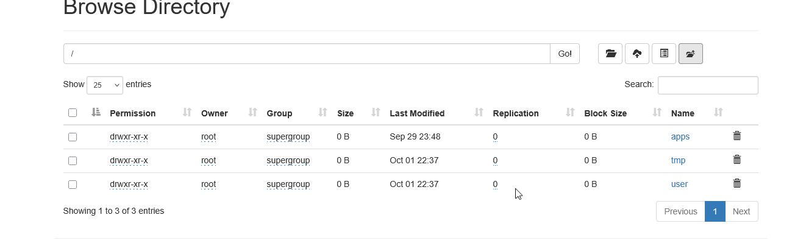


### Wine.csv dosyasını localden hadoop'a aktarma

Dosyayı localden hadoop ortamına aktarmak için aşağıdaki komutları kullanabiliriz.


```bash

 hdfs dfs -put Wine.csv /user/root/hdfs_odev

```

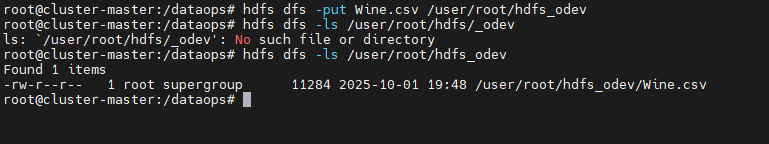

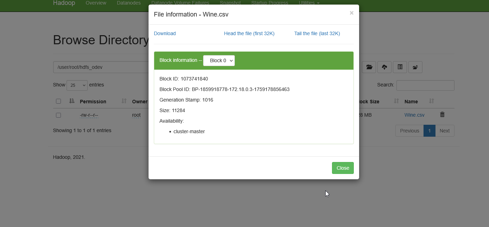
### Wine.csv dosyasını tmp/hdfs_odev klasörüne kopyalama

Dosyayı hadoop ortamında kopyalamak için -cp komutunu kullanabiliriz.

```bash

 hdfs dfs -put Wine.csv /user/root/hdfs_odev

```
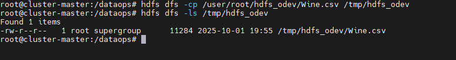

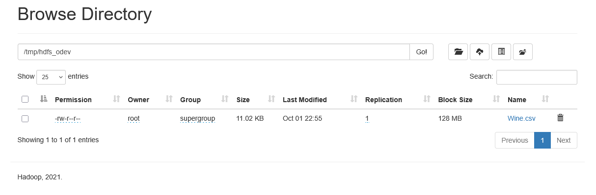


### HDFS üzerinden dosyayı silme 

Hadoop üzerinde dosyayı trashe gitmeden tamamen silmek için -skiptrash kullanmamız gerekiyor.

```bash

hdfs dfs -rm -r -skipTrash /tmp/hdfs_odev

```

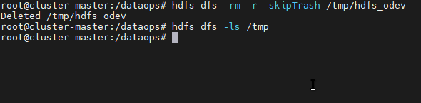

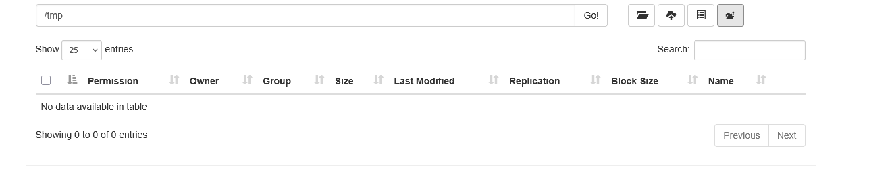


