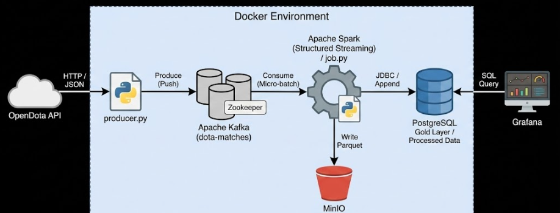

# Gerçek Zamanlı Dota 2 Veri Analitiği Hattı (Real-Time Data Pipeline)

Bu proje, dünyaca ünlü MOBA oyunu Dota 2'den akan canlı maç verilerini işleyen, depolayan ve görselleştiren uçtan uca görselleştiren bir data engineering projesidir.

Proje, dağınık ve ham veriyi anlamlı iş içgörülerine (Business Insights) dönüştürmek için Lambda Mimarisi ve modern veri yığınını (Modern Data Stack) kullanır.

## Mimari (Architecture)

Sistem, Docker konteynerleri üzerinde mikroservis mimarisiyle çalışmaktadır.

OpenDota API > Python Producer > Kafka > Spark Streaming > PostgreSQL & MinIO > Grafana

## Teknoloji Yığını (Tech Stack)

Katman (Layer)    Teknoloji                                        Kullanım Amacı

Ingestion          Apache Kafka & Zookeeper       Yüksek hacimli veri tamponlama (Buffering) ve mesaj kuyruğu yönetimi.

Source            Python (Requests)               OpenDota API'den veriyi çeken, sıkıştıran ve Kafka'ya ileten "Producer" servisi.
                                     
Processing         Spark (Structured Streaming)   ETL işlemleri, şema doğrulama, veri temizliği, zenginleştirme ve micro-batch 

Storage (Bronze)    MinIO (S3 Compatible)         Ham verilerin arşivlendiği Data Lake

Storage (Gold)     PostgreSQL                     İşlenmiş ve rapora hazır verilerin saklandığı Data Warehouse (İlişkisel Veritabanı).

Visualization       Grafana                       Gerçek zamanlı dashboard, KPI takibi ve iş zekası raporlaması.

## Tablo: `public_matches`

Bu tablo, Kafka'dan gelen ham maç verisinin temizlenmiş, dönüştürülmüş ve iş birimlerinin analiz ve sorgulama yapabilmesi için hazır hale getirilmiş versiyonudur.

### Tablo Yapısı

| Column              | Type           | Nullable | Description |
|---------------------|----------------|----------|-------------|
| `match_id`          | BIGINT         | YES      | Maçın benzersiz kimlik numarası. |
| `start_time`        | BIGINT         | YES      | Maçın başladığı orijinal Unix zaman damgası. |
| `duration`          | INTEGER        | YES      | Maçın saniye cinsinden toplam süresi. |
| `radiant_win`       | BOOLEAN        | YES      | TRUE ise Radiant, FALSE ise Dire kazanmıştır. |
| `radiant_score`     | INTEGER        | YES      | Radiant takımının toplam öldürme (kill) skoru. |
| `dire_score`        | INTEGER        | YES      | Dire takımının toplam öldürme (kill) skoru. |
| `lobby_type`        | INTEGER        | YES      | Oyunun lobi türünü temsil eden sayısal kod. |
| `comeback`          | INTEGER        | YES      | Kazanan takımın maç içinde geriye düştüğü maksimum altın farkı. |
| `throw`             | INTEGER        | YES      | Kaybeden takımın maç içinde yakaladığı maksimum altın avantajı. |
| `match_date`        | TEXT           | YES      | Maçın oynandığı okunabilir tarih ve saat bilgisi. |
| `duration_minutes`  | NUMERIC(10,2)  | YES      | Maç süresinin dakika cinsinden karşılığı. |
| `lobby_name`        | TEXT           | NO       | Lobi türünün okunabilir adı (örn: `Ranked`, `Normal`). |

## Çözülen İş Problemleri (Business Problems)

Bu proje oyun sektörü açısından aşağıdaki kritik iş sorularına gerçek zamanlı cevaplar üretir:

1. Oyun Dengesi (Game Balance Analytics)

Sorun: Harita tasarımındaki asimetri (Radiant vs Dire) haksız bir avantaja yol açıyor mu?

Çözüm: Ranked maçlardaki kazanma oranlarının (Win Rate) anlık takibi. %50 dengesinden sapmalar (örn: %55 üstü) alarm üretir.

2. Eşleştirme Kalitesi (Matchmaking Quality Control)

Sorun: Oyuncular çok hızlı biten, tek taraflı maçlardan şikayetçi mi?

Çözüm: 25 dakikadan kısa süren ve skor farkı yüksek olan maçların oranını izleyerek "Kalitesiz Maç" tespiti yapılması.

3. Altyapı Optimizasyonu (Cost & Infrastructure)

Sorun: Sunucular ne zaman tam kapasite çalışmalı? Maliyet tasarrufu nerede yapılabilir?

Çözüm: Günün saatlerine göre (Hourly Traffic Heatmap) oyuncu yoğunluğu analizi ve Auto-scaling kararları için veri sağlama.

5. Veri Bütünlüğü (Data Integrity & Engineering Metrics)

Sorun: Analiz sistemine giren veri güvenilir mi? Gecikme (Lag) var mı?

Çözüm: Hatalı/Eksik (Null) veri oranlarının ve System Latency (Olay zamanı vs İşleme zamanı) takibi.

## Veri Akış Şeması (Pipeline Logic)

Extract (Çıkarma): producer.py, OpenDota API'sinden maç ID'lerini ve detaylarını JSON formatında çeker.

Buffer (Tamponlama): Veriler dota-match-details topic'i altında Kafka'da kuyruğa alınır.

Transform (Dönüştürme): Spark, Kafka'dan okuduğu ham JSON verisini Schema Enforcement ile temizler.

Unix Timestamp -> Datetime dönüşümü.

Süre (Saniye) -> Dakika dönüşümü.

Kodlar (Lobby Type 7) -> Etiketler (Ranked) dönüşümü.

Load (Yükleme):

Canlı Veri (Sıcak Veri): İşlenmiş veri, canlı analiz için PostgreSQL'e Append modunda yazılır.

Ham  Veri:  Arşivleme için MinIO'ya Parquet formatında yazılır.

## Gelecek Geliştirmeler

Machine Learning: Spark MLlib kullanarak, maçın ilk 10 dakikasındaki verilere göre kazananı tahmin eden model eğitimi.

Airflow: Batch işlemlerin orkestrasyonu için Airflow entegrasyonu.

CI/CD: GitHub Actions ile otomatik test ve deployment süreçleri.
